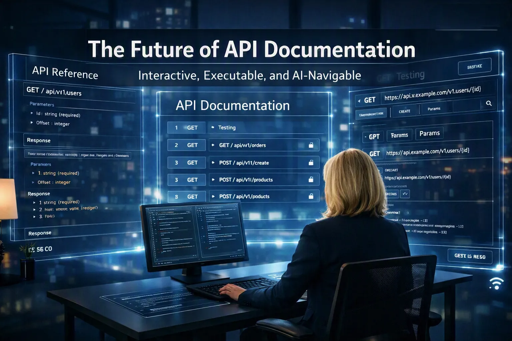

 🗣️Talk 🟢 Intermediate

## Short Abstract
API docs are shifting from static pages to interactive, executable, AI‑navigable experiences. This session covers contract-driven generation, executable examples, semantic search, and AI-assisted navigation, giving teams practical steps to build human- and agent-ready documentation.

## Abstract
API documentation is being reinvented. Static pages and outdated reference guides can’t support how developers and now AI systems actually build. In this session, you’ll see how modern, interactive, executable, AI‑navigable documentation transforms integration from a three‑day struggle into a smooth, minutes‑long workflow. Learn the essential practices for building human‑ and agent‑ready API docs, from enriched OpenAPI contracts to semantic search and agent‑operable metadata. If you want your APIs to flourish in the next five years, this talk shows you exactly where to start.

# Type
- 45/60-minute session

## Tags
       

## Learning Objectives
- Understand how API documentation must evolve from human-readable pages to AI-navigable and agent-operable contracts.

  Attendees will learn the four-stage evolution model (Human-Readable → Machine-Readable → AI-Navigable → Agent-Operable) and recognize where their current documentation actually sits today.

- Learn how semantic enrichment transforms API documentation into an interactive, executable, AI-ready system.

  Attendees will understand the six semantic investments (operation intent, workflow sequencing, parameter semantics, structured errors, resource relationships, and machine-readable changelogs) and how they eliminate drift, reduce integration time, and prevent AI hallucinations.

- Gain a practical roadmap for building human- and agent-ready documentation pipelines over the next five years.

  Attendees will leave with actionable steps: measure description coverage, enforce semantic linting, adopt Git-native documentation pipelines, enrich OpenAPI/AsyncAPI, publish MCP tool definitions, and build API knowledge graphs.

## Presentations

| Event | Location | Date | Time | Room | Downloads |
|-------|:--------:|-----:|-----:|-----:|----------:|
| API Conference New York 2026 | New York, NY | 2026-09-29 | 11:45 EDT | Brooklyn Bridge | [Slides](EventMaterials/FutureOfAPIDocumenetation-APIConNYC2026.pdf) |

Email [chadgreen@chadgreen.com](mailto:chadgreen@chadgreen.com?subject=Presentation%20Request:%20Presentation%20Title) to have Chad present this session at your event.